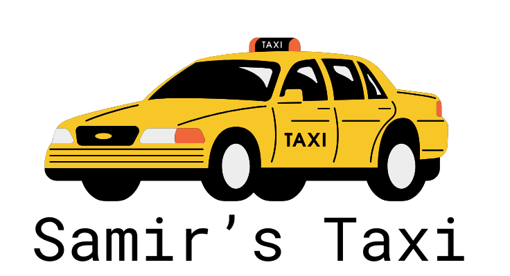

# Contract Testing Learning Hour 1

## Consumer Driven Contract Testing Code Koan

This code Koan is aimed at deliberately practicing developing a consumer driven contract using Pact.

Whilst contract testing can be applied retrospectively to already existing systems 
(*note: you may want to consider bi-directional contract testing for those use cases*), we will follow the 
[consumer driven contracts](https://martinfowler.com/articles/consumerDrivenContracts.html) approach in this kata - where a new consumer "goes first" producing 
a contract that the provider will use to TDD the endpoints in their service in parallel.  
Both parties can then be sure that they have built exactly what each other was expecting 
making integration or e2e testing between the real services a *"no surprises endgame"*.


**Koan/Kata outline**:

- [step 1: **Define the expectation of the provider**](https://github.com/jjwils/cdc-lh1-kata/tree/samirs-taxi-step1#step-1---define-the-expectation-of-the-provider): Define the provider API in a test in our Consumer codebase.
- [step 2: **Write a test against the mock provider**](https://github.com/jjwils/cdc-lh1-kata/tree/samirs-taxi-step2#step-2---write-a-test-against-the-mock-providers): Write a test against the mock provider
- [step 3: **Run the test and produce a contract**](https://github.com/jjwils/cdc-lh1-kata/tree/samirs-taxi-step3#step-3---run-the-test-and-produce-a-contract): Run the test and produce a contract


_NOTE: Each step is tied to, and must be run within, a git branch, allowing you to progress through each stage incrementally. For example, to move to step 2 run the following: `git checkout samirs-taxi-step2`_

## Requirements

- JDK 17+
- Maven 3+

## Scenario



*Samir loves driving his new car so much that he wants to start his own taxi business. He creates an application to keep track of his business.**

He agrees a partnership with a firm that will send him his next job when he calls an API at /job.  Luckily the firm knows all about pact and consumer driven contracts.
The first task is to create a contract that we can send to the firm so they can start developing their job API.
from the firm.

Here is the request that Samir decides they want to receive.
``` 
{
  "customer": {
    "firstName": "Prince",
    "lastName": "Ali",
    "phoneNumber": "07456978900"
  },
  "startLatitude": "53.35612531404332",
  "startLongitude": "-2.277333661375856",
  "endLatitude": "53.48064143725981",
  "endLongitude": "-2.2423585050324775",
  "return": "false",
}
```
## Step 1 - Define the expectation of the provider

*Provider states* is an important concept of Pact that we need to introduce. These states define the state that the provider should be in for specific interactions. For the moment, we will initially be testing the following state that 
is defined in the ```.given("a job exists")``` on line 4 below.
You can think of this as the *Given* step in *Given, When, Then* and is where *us the consumer* are designing the API of the provider *before it even exists*.

Your task is to fill out the TODO's below to create the API we want from the provider to meet Samir's expected response.

*Hint* - have a look at the traditional integration test in the JobServiceClientTest class.


```java
@Pact(consumer = "SamirsApp")
public RequestResponsePact getJob(PactDslWithProvider builder) {
return builder
.given("a job exists")
.uponReceiving("get job")
.path("TODO")
.willRespondWith()
.status(-1)//CHANGE THIS TO THE INT FOR HTTP.OK
.body(
new PactDslJsonBody()
.object("TODO", new PactDslJsonBody()
.stringType("TODO", "TODO")
.stringType("TODO", "TODO")
.stringType("TODO", "TODO")
)
.stringType("TODO", "TODO")
.stringType("TODO", "TODO")
.stringType("TODO", "TODO")
.stringType("TODO", "TODO")
.booleanType("TODO", false)
)
.toPact();
}
```

*Move on to [step 2](https://github.com/jjwils/cdc-lh1-kata/tree/samirs-taxi-step2#step-2---write-a-test-against-the-mock-providers)*

## Step 2 - Write a test against the mock provider

Now let's create a basic test for our mock provider. We're going to check 2 things:

1. That our client code hits the expected endpoint
1. That the response is marshalled into an object that is usable.

Notice how this is identical to the traditional integration test in the JobServiceClientTest class.


```java
 @Test
@PactTestFor(pactMethod = "getJob", pactVersion = PactSpecVersion.V3)
void should_get_job(MockServer mockServer) {
    jobServiceClient.setBaseUrl(mockServer.getUrl());
    Job job = jobServiceClient.getJob();
    assertThat(job, is(equalTo(new Job(
            new Customer("TODO", "TODO", "TODO"),
            "TODO",
            "TODO",
            "TODO",
            "TODO",
            false
    ))));
}
```


*Move on to [step 3](https://github.com/jjwils/cdc-lh1-kata/tree/samirs-taxi-step3#step-3---run-the-test-and-produce-a-contract)*


